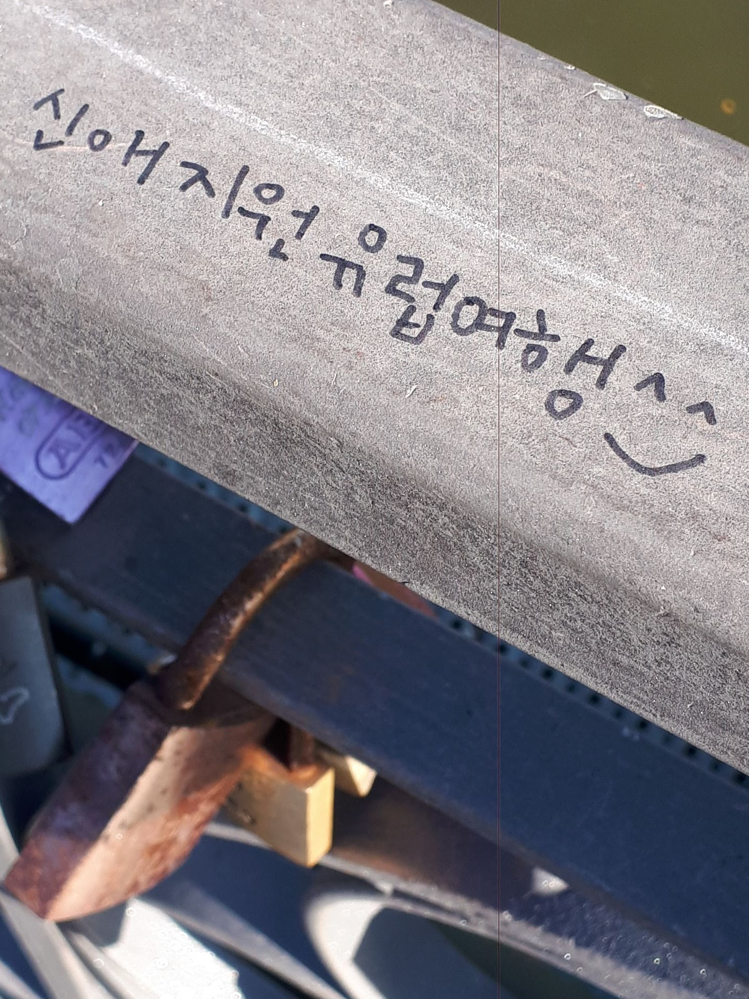

## eiserner steg mystery message: 

### Background
Whilst on Eisrner-steg in Frankfurt am Main, there was some message written what looked to be korean or some asian language. So what language is it and what does it mean? What a better way to test out training data saved from sourceforge for letter extraction and google translate api using kotlin. As a side note to run this package, one must download the training data into the folder tessdata on this applcation from [sourceforge](https://github.com/tesseract-ocr/tessdata.git). It takes a while to download ... 

The text in its original photo looks like (I hope my phone camera with a line down the middle is good enough ))) : 

### The original image

### And after text extraction using source force

### And after translating with google translate API

